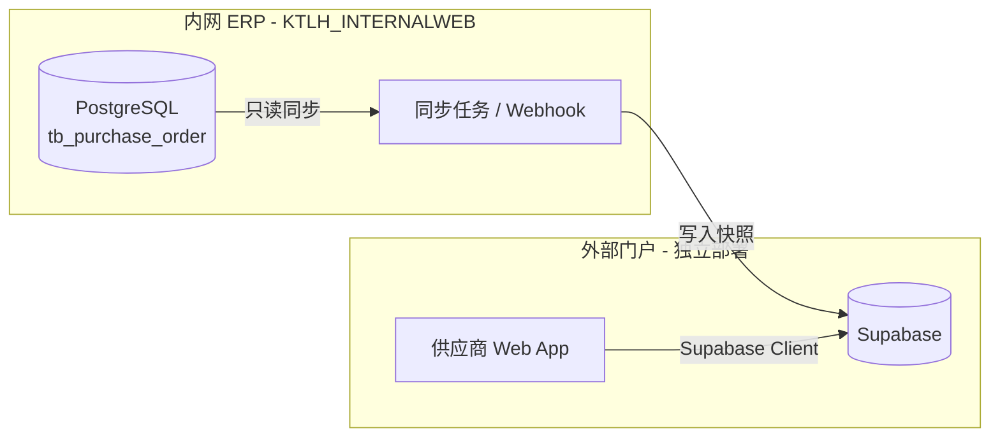
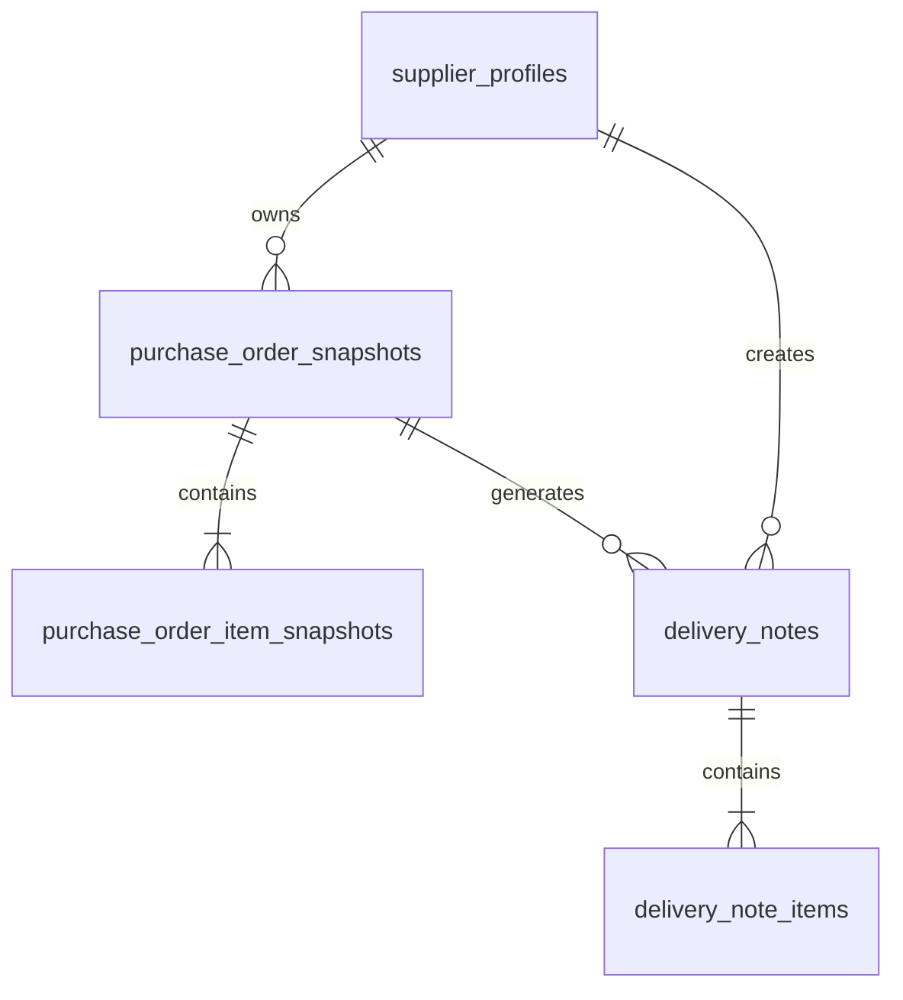
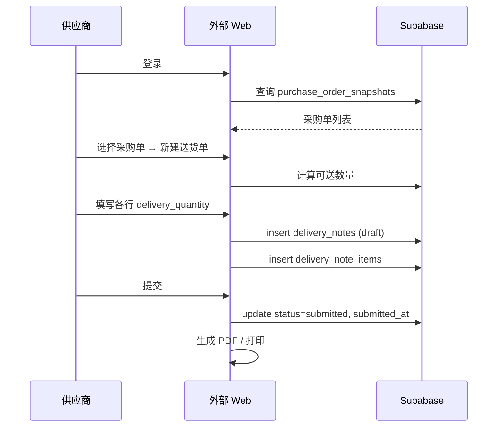

# 供应商送货单外部门户 — 开发规格书

> **用途**：交给另一个 AI / 开发团队，实现「供应商根据采购订单生成送货单」的外部网页。  
> **存储**：外部数据全部落在 **Supabase**（Auth + Postgres + Storage）。  
> **数据源**：采购订单来自内网 ERP（`KTLH_INTERNALWEB`），通过同步写入 Supabase，**不直接暴露内网数据库**。

---

## 1. 背景与目标

### 1.1 业务背景

内网 ERP 已有完整采购流程：

1. 采购部创建采购单 → `tb_purchase_order` + `tb_purchase_order_item`
2. 生成采购单 PDF 发给供应商
3. 供应商送货
4. 仓库在「出入库记录」中按 `purchase_order_item_id` 入库 → 更新 `received_quantity`

**缺口**：供应商侧没有系统化「送货单」；仓库入库时只能对照纸质单或微信。

### 1.2 本外部系统目标

| 目标 | 说明 |
|------|------|
| 供应商登录 / 链接访问 | 查看分配给自己的采购单 |
| 按采购单生成送货单 | 支持整单或分批送货 |
| 打印 / 导出 PDF | 送货时随车/随货 |
| 数据存 Supabase | 与内网库隔离，可公网部署 |
| 为内网对接预留字段 | 后续内网可拉取「已提交送货单」辅助仓库收货 |

### 1.3 不在本期范围（可二期）

- 内网自动根据送货单入库（本期仅生成送货单）
- 供应商修改采购单
- 在线对账 / 发票

---

## 2. 系统边界



| 系统 | 职责 |
|------|------|
| **内网 ERP** | 采购单主数据、收货数量 `received_quantity`、库存 |
| **Supabase** | 供应商账号、采购单快照、送货单、PDF 附件 |
| **外部 Web** | UI、校验、生成送货单号、调用 Supabase |

**原则**：Supabase 中的采购单是**快照**（sync 时刻复制），送货单是**外部主数据**；内网 `received_quantity` 仍以仓库入库为准。

---

## 3. 内网采购单数据结构（同步来源）

开发外部页面前，需理解内网字段含义（同步到 Supabase 时映射）。

### 3.1 `tb_purchase_order`（采购单主表）

| 字段 | 类型 | 说明 |
|------|------|------|
| `id` | int | 内网主键 → Supabase 存为 `internal_order_id` |
| `order_number` | string | 采购单号，格式 `CG` + `YYYYMMDD` + 4位序号，如 `CG202506300001` |
| `supplier_id` | int? | 供应商 ID |
| `order_time` | timestamp | 下单时间 |
| `expected_arrival_time` | timestamp? | 预计到达 |
| `order_amount` | decimal | 订单总金额 |
| `payment_status` | string | `未付款` / `部分付款` / `已付款` |
| `order_status` | string | `待处理` / `处理中` / `已收货` / `已完成` / `已取消` |
| `responsible_person` | string? | 内网负责人 |
| `remark` | text? | 备注 |
| `creator` | string? | 创建人 email |

**供应商可见条件**（同步时过滤）：

- `order_status` NOT IN (`已取消`, `已完成`)
- `supplier_id` 匹配该供应商
- 至少有一行明细 `received_quantity < order_quantity`（仍有未送完数量）

### 3.2 `tb_purchase_order_item`（采购明细）

| 字段 | 类型 | 说明 |
|------|------|------|
| `id` | int | 内网明细 ID → `internal_order_item_id` |
| `order_id` | int | 所属采购单 |
| `material_code` | string? | 物料编码 |
| `material_name` | string | 物料名称 |
| `material_spec` | string? | 规格 |
| `unit` | string | 单位 |
| `unit_price` | decimal | 单价（送货单可显示，供应商一般不改价） |
| `order_quantity` | decimal | 订购数量 |
| `received_quantity` | decimal | **内网已收货数量**（仓库入库累加） |
| `item_amount` | decimal | 行金额 |
| `remark` | text? | 行备注 |

**可送数量**（外部系统计算）：

```
deliverable_qty = order_quantity - received_quantity - pending_delivery_qty
```

- `pending_delivery_qty` = 该明细在 Supabase 中状态为 `submitted` 的送货单行数量之和（已提交待内网收货）

### 3.3 `tb_purchase_supplier`（供应商）

| 字段 | 说明 |
|------|------|
| `id` | 内网供应商 ID → `internal_supplier_id` |
| `supplier_name` | 供应商全称 |
| `supplier_type` | `个人` / `企业` |
| `contact_person` / `contact_phone` / `email` / `address` | 联系信息 |
| `tax_number` / `bank_name` / `bank_account` | 可选 |

### 3.4 买方固定信息（来自内网采购单 PDF）

生成送货单时「收货方」使用固定值：

| 字段 | 值 |
|------|-----|
| 买方单位 | 青岛开拓隆海智控有限公司 |
| 买方地址 | 青岛胶州上合经济开发区湘江路21号 |
| 买方联系人 | 采购单 `responsible_person`（无则留空） |

### 3.5 内网 API 响应格式（供同步服务参考）

```json
{
  "code": 200,
  "msg": "查询成功",
  "data": {}
}
```

- `code === 200` 为成功
- 内网采购相关接口前缀：`/api/purchase/*`（**需 JWT，供应商不可直接调**）

---

## 4. 用户角色与认证

### 4.1 推荐方案：Supabase Auth + 供应商档案

| 角色 | 认证方式 | 权限 |
|------|----------|------|
| 供应商用户 | Email + 密码（Supabase Auth） | 仅本供应商采购单与送货单 |
| 供应商用户 | Magic Link（可选） | 同上 |
| 匿名（可选） | 采购单 Token 链接 | 仅该张采购单只读 + 生成一张送货单 |

### 4.2 表 `supplier_profiles`

每个 Supabase Auth 用户绑定一个内网供应商：

```sql
supplier_profiles (
  id uuid PK → auth.users.id,
  internal_supplier_id int NOT NULL UNIQUE,
  supplier_name text NOT NULL,
  contact_name text,
  phone text,
  is_active boolean DEFAULT true,
  created_at timestamptz,
  updated_at timestamptz
)
```

**注册流程（建议）**：

1. 内网采购部预先在 Supabase 创建供应商账号，或发邀请链接
2. `internal_supplier_id` 与内网 `tb_purchase_supplier.id` 一致
3. 未绑定 `internal_supplier_id` 的用户看不到任何采购单

### 4.3 可选：采购单 Magic Link

内网生成采购单 PDF 时，附带链接：

```
https://supplier.example.com/po/{access_token}
```

- `purchase_order_snapshots.access_token` = 随机 UUID（32+ 字符）
- 无需登录即可查看该单并填送货单
- RLS：仅 token 匹配可读

---

## 5. Supabase 数据库设计

### 5.1 ER 关系



### 5.2 完整 SQL（Migration）

```sql
-- 扩展
create extension if not exists "pgcrypto";

-- 供应商档案（绑定 Supabase Auth）
create table public.supplier_profiles (
  id uuid primary key references auth.users(id) on delete cascade,
  internal_supplier_id integer not null unique,
  supplier_name text not null,
  contact_name text,
  phone text,
  email text,
  address text,
  is_active boolean not null default true,
  created_at timestamptz not null default now(),
  updated_at timestamptz not null default now()
);

-- 采购单快照（由内网同步写入）
create table public.purchase_order_snapshots (
  id uuid primary key default gen_random_uuid(),
  internal_order_id integer not null unique,
  internal_supplier_id integer not null,
  order_number text not null unique,
  order_time timestamptz not null,
  expected_arrival_time timestamptz,
  order_amount numeric(12,2) not null default 0,
  order_status text not null,
  payment_status text,
  responsible_person text,
  remark text,
  buyer_company text not null default '青岛开拓隆海智控有限公司',
  buyer_address text not null default '青岛胶州上合经济开发区湘江路21号',
  access_token text unique,
  synced_at timestamptz not null default now(),
  created_at timestamptz not null default now(),
  updated_at timestamptz not null default now()
);

create index idx_po_snapshots_supplier on public.purchase_order_snapshots(internal_supplier_id);
create index idx_po_snapshots_status on public.purchase_order_snapshots(order_status);
create index idx_po_snapshots_token on public.purchase_order_snapshots(access_token);

-- 采购明细快照
create table public.purchase_order_item_snapshots (
  id uuid primary key default gen_random_uuid(),
  snapshot_order_id uuid not null references public.purchase_order_snapshots(id) on delete cascade,
  internal_order_item_id integer not null unique,
  material_code text,
  material_name text not null,
  material_spec text,
  unit text not null,
  unit_price numeric(10,2) not null default 0,
  order_quantity numeric(10,2) not null,
  received_quantity numeric(10,2) not null default 0,
  item_amount numeric(12,2) not null default 0,
  remark text,
  synced_at timestamptz not null default now(),
  created_at timestamptz not null default now(),
  updated_at timestamptz not null default now()
);

create index idx_po_item_snapshots_order on public.purchase_order_item_snapshots(snapshot_order_id);
create index idx_po_item_snapshots_material on public.purchase_order_item_snapshots(material_code);

-- 送货单主表
create table public.delivery_notes (
  id uuid primary key default gen_random_uuid(),
  delivery_number text not null unique,
  snapshot_order_id uuid not null references public.purchase_order_snapshots(id),
  internal_order_id integer not null,
  internal_supplier_id integer not null,
  supplier_profile_id uuid references public.supplier_profiles(id),
  supplier_name text not null,
  supplier_contact text,
  supplier_phone text,
  supplier_address text,
  buyer_company text not null,
  buyer_address text not null,
  buyer_contact text,
  delivery_date date not null,
  expected_arrival_time timestamptz,
  vehicle_plate text,
  driver_name text,
  driver_phone text,
  status text not null default 'draft'
    check (status in ('draft', 'submitted', 'cancelled')),
  remark text,
  pdf_storage_path text,
  submitted_at timestamptz,
  created_at timestamptz not null default now(),
  updated_at timestamptz not null default now()
);

create index idx_delivery_notes_order on public.delivery_notes(snapshot_order_id);
create index idx_delivery_notes_supplier on public.delivery_notes(internal_supplier_id);
create index idx_delivery_notes_status on public.delivery_notes(status);
create index idx_delivery_notes_number on public.delivery_notes(delivery_number);

-- 送货单明细
create table public.delivery_note_items (
  id uuid primary key default gen_random_uuid(),
  delivery_note_id uuid not null references public.delivery_notes(id) on delete cascade,
  snapshot_item_id uuid not null references public.purchase_order_item_snapshots(id),
  internal_order_item_id integer not null,
  material_code text,
  material_name text not null,
  material_spec text,
  unit text not null,
  unit_price numeric(10,2) not null default 0,
  delivery_quantity numeric(10,2) not null check (delivery_quantity > 0),
  line_remark text,
  sort_order integer not null default 0,
  created_at timestamptz not null default now()
);

create index idx_delivery_note_items_note on public.delivery_note_items(delivery_note_id);

-- 送货单号序列表（按日）
create table public.delivery_number_seq (
  seq_date date primary key,
  last_seq integer not null default 0
);
```

### 5.3 送货单号规则

格式：`SH` + `YYYYMMDD` + 4位序号

示例：`SH202506300001`

```sql
create or replace function public.next_delivery_number()
returns text
language plpgsql
as $$
declare
  d date := current_date;
  n int;
begin
  insert into delivery_number_seq(seq_date, last_seq)
  values (d, 1)
  on conflict (seq_date) do update
    set last_seq = delivery_number_seq.last_seq + 1
  returning last_seq into n;
  return 'SH' || to_char(d, 'YYYYMMDD') || lpad(n::text, 4, '0');
end;
$$;
```

---

## 6. Row Level Security（RLS）

**所有表开启 RLS。**

### 6.1 `supplier_profiles`

```sql
alter table supplier_profiles enable row level security;

create policy "supplier read own profile"
  on supplier_profiles for select
  using (auth.uid() = id);

create policy "supplier update own profile"
  on supplier_profiles for update
  using (auth.uid() = id);
```

### 6.2 `purchase_order_snapshots`

```sql
alter table purchase_order_snapshots enable row level security;

create policy "supplier read own PO snapshots"
  on purchase_order_snapshots for select
  using (
    internal_supplier_id in (
      select internal_supplier_id from supplier_profiles
      where id = auth.uid() and is_active = true
    )
  );
```

### 6.3 `purchase_order_item_snapshots`

```sql
alter table purchase_order_item_snapshots enable row level security;

create policy "supplier read own PO item snapshots"
  on purchase_order_item_snapshots for select
  using (
    snapshot_order_id in (
      select id from purchase_order_snapshots
      where internal_supplier_id in (
        select internal_supplier_id from supplier_profiles
        where id = auth.uid() and is_active = true
      )
    )
  );
```

### 6.4 `delivery_notes` / `delivery_note_items`

```sql
alter table delivery_notes enable row level security;
alter table delivery_note_items enable row level security;

create policy "supplier CRUD own delivery notes"
  on delivery_notes for all
  using (
    supplier_profile_id = auth.uid()
    or internal_supplier_id in (
      select internal_supplier_id from supplier_profiles where id = auth.uid()
    )
  )
  with check (
    supplier_profile_id = auth.uid()
    and status in ('draft', 'submitted', 'cancelled')
  );

create policy "supplier CRUD own delivery note items"
  on delivery_note_items for all
  using (
    delivery_note_id in (
      select id from delivery_notes
      where supplier_profile_id = auth.uid()
    )
  );
```

**Service Role**：内网同步任务使用 `service_role` key，绕过 RLS 写入快照。

---

## 7. 内网 → Supabase 同步规格

> 本节给内网团队实现；外部 AI 只需按此结构读 Supabase。

### 7.1 触发时机

| 事件 | 动作 |
|------|------|
| 采购单创建 | 全量 upsert 快照 |
| 采购单更新（状态、预计到达） | 更新快照 |
| 仓库入库（`received_quantity` 变化） | 更新对应 `purchase_order_item_snapshots.received_quantity` |
| 采购单取消/完成 | 更新 `order_status`，外部列表隐藏或只读 |

### 7.2 同步 Payload 示例

```json
{
  "order": {
    "internal_order_id": 123,
    "internal_supplier_id": 5,
    "order_number": "CG202506300001",
    "order_time": "2025-06-30T10:00:00",
    "expected_arrival_time": "2025-07-05T08:00:00",
    "order_amount": 12500.00,
    "order_status": "待处理",
    "payment_status": "未付款",
    "responsible_person": "张三",
    "remark": "加急"
  },
  "items": [
    {
      "internal_order_item_id": 456,
      "material_code": "100000123",
      "material_name": "无缝钢管",
      "material_spec": "Φ50×3",
      "unit": "kg",
      "unit_price": 12.50,
      "order_quantity": 1000,
      "received_quantity": 200,
      "item_amount": 12500.00,
      "remark": ""
    }
  ],
  "supplier": {
    "internal_supplier_id": 5,
    "supplier_name": "某某钢铁有限公司",
    "contact_person": "李经理",
    "contact_phone": "13800000000",
    "address": "山东省济南市..."
  }
}
```

### 7.3 内网需新增的接口（建议，尚未实现）

```
POST /api/internal/sync/purchase-order-to-supabase
Authorization: Bearer <INTERNAL_SYNC_SECRET>
```

或定时任务 + Supabase `service_role` 直接 upsert。

**外部项目第一期可 mock**：用 Supabase SQL Editor 手工插入测试快照。

---

## 8. 外部 Web 功能与页面

### 8.1 页面清单

| 路由 | 页面 | 说明 |
|------|------|------|
| `/login` | 登录 | Supabase Auth |
| `/` | 采购单列表 | 进行中的采购单，显示未送完数量 |
| `/po/:id` | 采购单详情 | 明细、已收/未收、历史送货单 |
| `/po/:id/delivery/new` | 新建送货单 | 选行、填本次送货数量 |
| `/delivery/:id` | 送货单详情 | 预览、编辑草稿、提交 |
| `/delivery/:id/print` | 打印/PDF | 浏览器打印或 html2pdf |
| `/po/token/:access_token` | Magic Link 入口 | 可选，免登录 |

### 8.2 核心用户流程



### 8.3 列表页字段

**采购单列表**每行显示：

- 采购单号 `order_number`
- 采购日期 `order_time`
- 预计到达 `expected_arrival_time`
- 订单状态 `order_status`
- 明细行数 / 未送完行数
- 操作：「生成送货单」

### 8.4 新建送货单表单

**表头字段**：

| 字段 | 必填 | 默认 |
|------|------|------|
| `delivery_date` | 是 | 今天 |
| `expected_arrival_time` | 否 | 继承采购单 |
| `vehicle_plate` | 否 | |
| `driver_name` | 否 | |
| `driver_phone` | 否 | |
| `remark` | 否 | |

**明细行**（至少 1 行，`delivery_quantity > 0`）：

| 列 | 说明 |
|----|------|
| 物料编码 | 只读 |
| 物料名称 | 只读 |
| 规格 | 只读 |
| 单位 | 只读 |
| 订购数量 | 只读 |
| 已收货（内网） | 只读 `received_quantity` |
| 待收（已提交送货单） | 计算 |
| **本次送货数量** | 可编辑 |
| 行备注 | 可选 |

### 8.5 校验规则（必须在前后端都实现）

```typescript
function getPendingQty(itemId: string): number {
  // SUM(delivery_quantity) FROM delivery_note_items
  // JOIN delivery_notes WHERE status = 'submitted' AND snapshot_item_id = itemId
}

function getDeliverableQty(item): number {
  return item.order_quantity - item.received_quantity - getPendingQty(item.id)
}

function validateLine(item, deliveryQty): string | null {
  if (deliveryQty <= 0) return '送货数量须大于 0'
  if (deliveryQty > getDeliverableQty(item)) return '超过可送数量'
  return null
}
```

- `draft` 可修改、可删除
- `submitted` 不可改数量（只能 `cancelled` 后重建，或二期做「作废申请」）
- 整张送货单至少 1 行有效明细

---

## 9. 送货单 PDF / 打印布局

### 9.1 标题

**送货单**（居中）

### 9.2 表头信息（两列）

| 左（供方） | 右（需方） |
|------------|------------|
| 送货单号 | 采购单号 |
| 供方单位 | 需方单位 |
| 供方地址 | 需方地址 |
| 联系人 / 电话 | 联系人 |
| 送货日期 | 预计到达 |
| 车牌号 / 司机 | |

### 9.3 明细表

| 序号 | 物料编码 | 物料名称 | 规格 | 单位 | 单价 | 送货数量 | 金额 | 备注 |
|------|----------|----------|------|------|------|----------|------|------|

- 金额 = `unit_price * delivery_quantity`（展示用）
- 底部合计：总数量、总金额

### 9.4 签字栏

```
送货人签字：________    收货人签字：________    日期：________
```

### 9.5 PDF 实现建议

- 前端：`@react-pdf/renderer` 或 `html2canvas` + `jspdf`
- 可选：Supabase Edge Function 生成 PDF 上传 Storage
- Storage bucket：`delivery-pdfs`（路径 `{delivery_note_id}.pdf`）

---

## 10. Supabase Storage

| 路径 | 说明 |
|------|------|
| `delivery-pdfs/{delivery_note_id}.pdf` | 提交后生成的 PDF |

bucket `delivery-pdfs` 设为 private；RLS 策略：仅供应商本人可读自己的 PDF。

---

## 11. 技术栈建议

| 层 | 推荐 |
|----|------|
| 框架 | Next.js 14+ App Router 或 Vite + React |
| UI | Tailwind + shadcn/ui |
| 数据 | `@supabase/supabase-js` v2 |
| 表单 | react-hook-form + zod |
| 日期 | dayjs |
| PDF | `@react-pdf/renderer` |
| 部署 | Vercel / Cloudflare Pages |

### 11.1 环境变量

```env
NEXT_PUBLIC_SUPABASE_URL=https://xxxx.supabase.co
NEXT_PUBLIC_SUPABASE_ANON_KEY=eyJ...
# 仅服务端同步用，不要打进前端 bundle
SUPABASE_SERVICE_ROLE_KEY=eyJ...
```

---

## 12. 关键 TypeScript 类型

```typescript
export type DeliveryNoteStatus = 'draft' | 'submitted' | 'cancelled'

export interface PurchaseOrderSnapshot {
  id: string
  internal_order_id: number
  internal_supplier_id: number
  order_number: string
  order_time: string
  expected_arrival_time: string | null
  order_amount: number
  order_status: string
  payment_status: string | null
  responsible_person: string | null
  remark: string | null
  buyer_company: string
  buyer_address: string
  synced_at: string
}

export interface PurchaseOrderItemSnapshot {
  id: string
  snapshot_order_id: string
  internal_order_item_id: number
  material_code: string | null
  material_name: string
  material_spec: string | null
  unit: string
  unit_price: number
  order_quantity: number
  received_quantity: number
  item_amount: number
  remark: string | null
}

export interface DeliveryNote {
  id: string
  delivery_number: string
  snapshot_order_id: string
  internal_order_id: number
  internal_supplier_id: number
  supplier_profile_id: string | null
  supplier_name: string
  supplier_contact: string | null
  supplier_phone: string | null
  supplier_address: string | null
  buyer_company: string
  buyer_address: string
  buyer_contact: string | null
  delivery_date: string
  expected_arrival_time: string | null
  vehicle_plate: string | null
  driver_name: string | null
  driver_phone: string | null
  status: DeliveryNoteStatus
  remark: string | null
  pdf_storage_path: string | null
  submitted_at: string | null
  created_at: string
  updated_at: string
}

export interface DeliveryNoteItem {
  id: string
  delivery_note_id: string
  snapshot_item_id: string
  internal_order_item_id: number
  material_code: string | null
  material_name: string
  material_spec: string | null
  unit: string
  unit_price: number
  delivery_quantity: number
  line_remark: string | null
  sort_order: number
}
```

---

## 13. 示例 API 调用（Supabase Client）

### 13.1 获取我的采购单列表

```typescript
const { data: profile } = await supabase
  .from('supplier_profiles')
  .select('internal_supplier_id')
  .eq('id', user.id)
  .single()

const { data: orders } = await supabase
  .from('purchase_order_snapshots')
  .select(`
    *,
    items:purchase_order_item_snapshots(*)
  `)
  .eq('internal_supplier_id', profile.internal_supplier_id)
  .not('order_status', 'in', '("已完成","已取消")')
  .order('order_time', { ascending: false })
```

### 13.2 创建送货单（草稿）

```typescript
const { data: deliveryNumber } = await supabase.rpc('next_delivery_number')

const { data: note } = await supabase
  .from('delivery_notes')
  .insert({
    delivery_number: deliveryNumber,
    snapshot_order_id: poSnapshot.id,
    internal_order_id: poSnapshot.internal_order_id,
    internal_supplier_id: poSnapshot.internal_supplier_id,
    supplier_profile_id: user.id,
    supplier_name: profile.supplier_name,
    buyer_company: poSnapshot.buyer_company,
    buyer_address: poSnapshot.buyer_address,
    buyer_contact: poSnapshot.responsible_person,
    delivery_date: '2025-06-30',
    status: 'draft',
  })
  .select()
  .single()

await supabase.from('delivery_note_items').insert(
  lines.map((line, i) => ({
    delivery_note_id: note.id,
    snapshot_item_id: line.snapshot_item_id,
    internal_order_item_id: line.internal_order_item_id,
    material_code: line.material_code,
    material_name: line.material_name,
    material_spec: line.material_spec,
    unit: line.unit,
    unit_price: line.unit_price,
    delivery_quantity: line.delivery_quantity,
    sort_order: i,
  }))
)
```

### 13.3 提交送货单

```typescript
await supabase
  .from('delivery_notes')
  .update({ status: 'submitted', submitted_at: new Date().toISOString() })
  .eq('id', noteId)
  .eq('status', 'draft')
```

---

## 14. 与内网仓库的后续对接（二期预留）

内网 `tb_inventory_transaction` 入库时已支持：

- `purchase_order_item_id`（内网明细 ID）
- `related_order_type = '采购订单'`

**二期建议**：

1. 内网拉取 Supabase `delivery_notes`（`status=submitted`）
2. 仓库入库界面扫描送货单号 `delivery_number` 或二维码
3. 自动带出明细与建议数量
4. 入库成功后回调 Supabase 标记 `received`（或继续只靠 `received_quantity` 同步）

外部表可增加：

```sql
alter table delivery_notes add column internal_received_at timestamptz;
alter table delivery_notes add column internal_received_by text;
```

---

## 15. 测试数据（Seed）

```sql
-- 假设已有 auth user: xxxxxxxx-xxxx-xxxx-xxxx-xxxxxxxxxxxx

insert into supplier_profiles (id, internal_supplier_id, supplier_name, contact_name, phone)
values ('xxxxxxxx-xxxx-xxxx-xxxx-xxxxxxxxxxxx', 5, '测试供应商有限公司', '王经理', '13800000000');

insert into purchase_order_snapshots (
  internal_order_id, internal_supplier_id, order_number, order_time,
  order_status, payment_status, order_amount
) values (
  123, 5, 'CG202506300001', '2025-06-30T10:00:00+08',
  '待处理', '未付款', 12500.00
) returning id;
-- 用返回的 id 插入 purchase_order_item_snapshots
```

---

## 16. 安全 checklist

- [ ] 前端仅使用 `anon` key，RLS 必须开启
- [ ] `service_role` 仅用于内网同步服务
- [ ] 采购单 Magic Link token 足够长（≥32 字节随机）
- [ ] 提交送货单前服务端校验可送数量（Supabase Edge Function 或 DB trigger）
- [ ] 限流：登录、提交接口
- [ ] 不在外部系统暴露内网 API / 数据库连接串

---

## 17. 内网现有能力索引（供联调）

| 能力 | 内网位置 |
|------|----------|
| 采购单 CRUD | `POST/GET/PUT/DELETE /api/purchase/order` |
| 采购单 PDF | `GET /api/purchase/order/{id}/download-pdf` |
| 仓库入库关联采购明细 | `POST /api/warehouse/inventory-transaction` + `purchase_order_item_id` |
| 待入库采购明细查询 | `GET /api/warehouse/purchase-order/pending-receive?material_code=` |
| 公开页参考实现 | `backend/routes/public_routes.py`（设备扫码 token 模式） |

### 17.1 内网采购单状态枚举

**`order_status`**：`待处理` | `处理中` | `已收货` | `已完成` | `已取消`

**`payment_status`**：`未付款` | `部分付款` | `已付款`

### 17.2 内网采购单号规则

`CG` + `YYYYMMDD` + 4位流水号，例如 `CG202506300001`。

### 17.3 内网收货逻辑

物料入库时（`backend/routes/warehouse.py`）：

1. 必须传 `purchase_order_item_id`
2. 入库成功后 `tb_purchase_order_item.received_quantity` 累加
3. **不会**自动更新 `tb_purchase_order.order_status`

---

## 18. 交付物清单（实现 AI 应产出）

1. Supabase migration SQL（第 5 节 + RLS）
2. React/Next 外部站点（第 8 节页面）
3. 登录 + 供应商档案绑定
4. 采购单列表 / 详情 / 新建送货单 / 提交 / 打印 PDF
5. 可送数量校验逻辑
6. README：环境变量、本地开发、部署步骤
7. （可选）Supabase Edge Function：`submit_delivery_note` 带校验

---

**文档版本**：v1.0  
**基于内网代码库**：`KTLH_INTERNALWEB`  
**相关内网文件**：`backend/routes/purchase.py`、`backend/routes/warehouse.py`、`backend/database/schema.sql`
